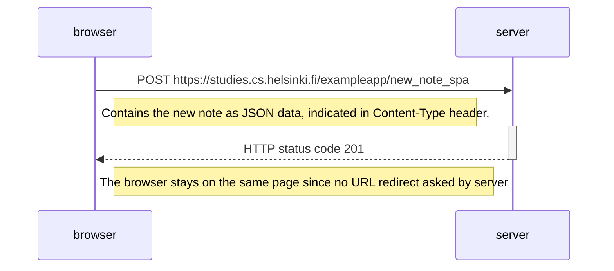

```mermaid
sequenceDiagram
    participant browser
    participant server

    browser->>server: POST https://studies.cs.helsinki.fi/exampleapp/new_note_spa

    Note right of browser: Contains the new note as JSON data, indicated in Content-Type header.

    activate server
    server-->>browser: HTTP status code 201
    deactivate server

    Note right of browser: The browser stays on the same page since no URL redirect asked by server

```
